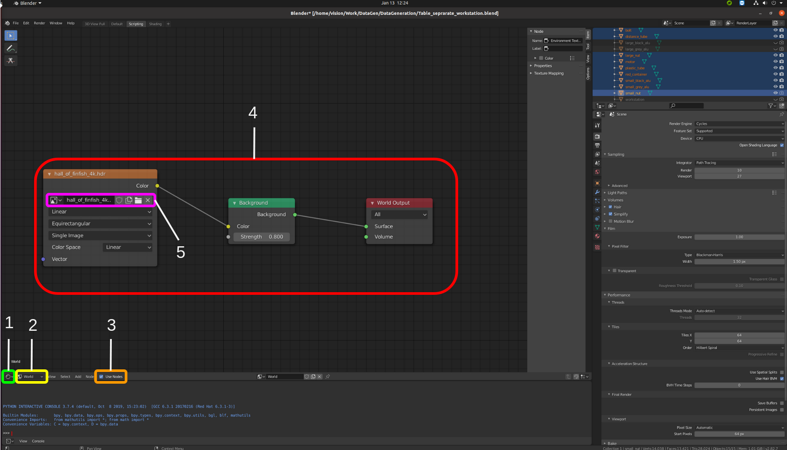
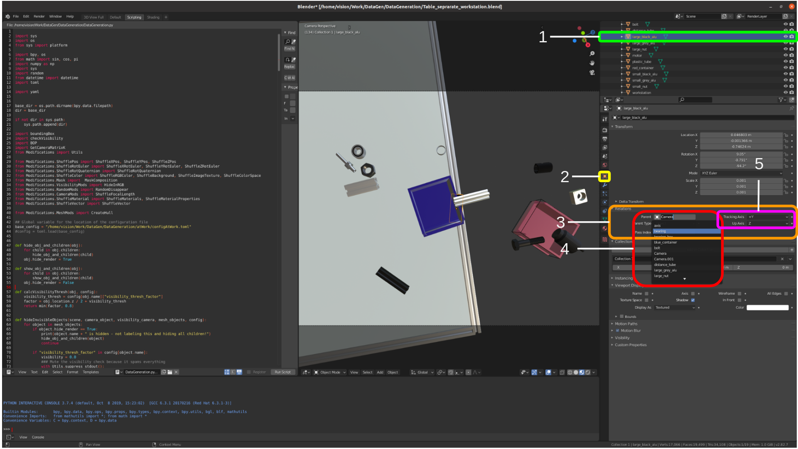
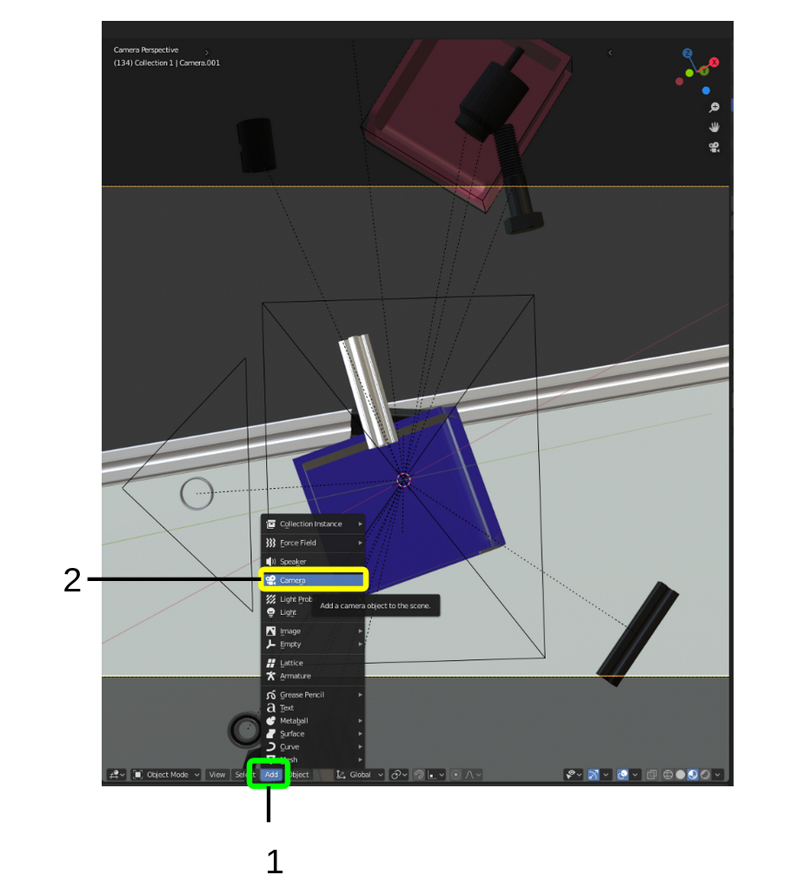
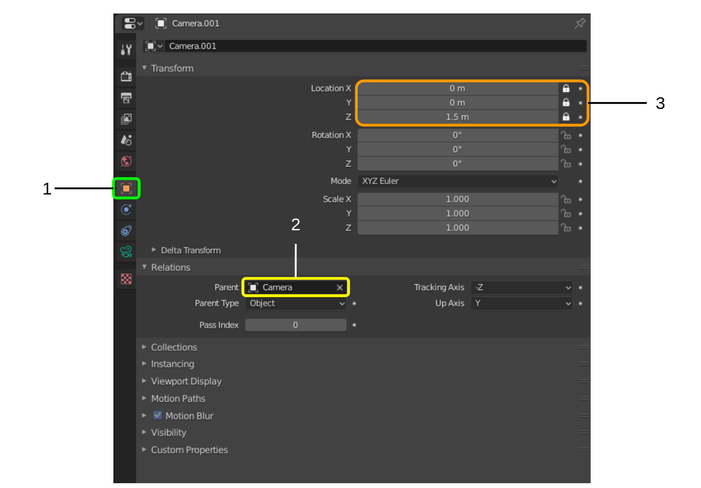
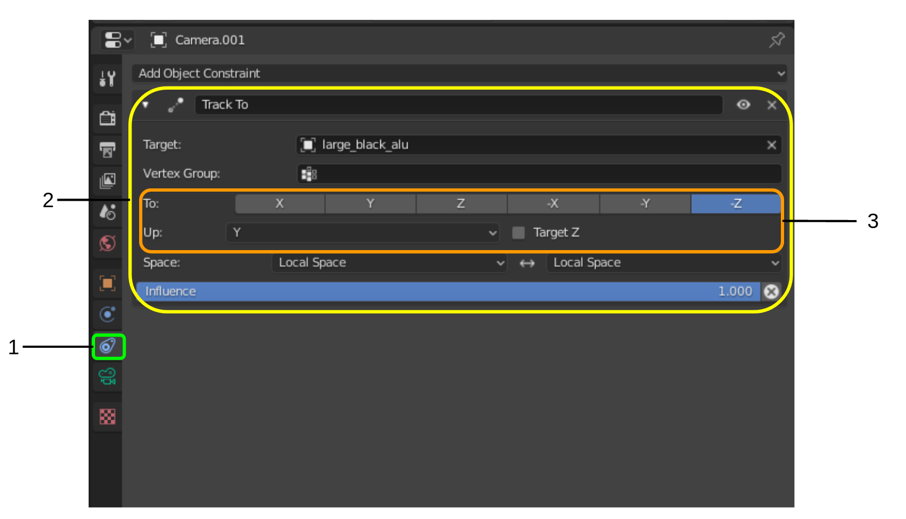

# DataGeneration
Automatic data generation for trainining object detection networks. 

## Usage

- Build your scene using Blender
- Adapt the config.toml File
- Load the DataGeneration.py into the Blender Text Editor
- Open a Viewport next to the Script Editor - make sure the Viewport is in *Object* mode
- Hit *Run Script*

## Dependencies

The data generation script uses packages such as toml, these need to be installed manually.
To do that, navigate to Blender's Python installation

''' cd path/to/blender/blender-2.82a/2.82/python/bin '''

In this folder you should find a python executable called python3.x where x is your specific python version depending on which Blender version you are using
Run the following command to install pip with python3.x being your python executable
 
''' ./python3.x -m ensurepip '''

Then install the packages using the python executable

''' ./python3.x -m pip install toml pyyaml scipy '''

Now you are ready to go!

## Building a scene

This chapter describes an example scene setup that is usefull for most use cases. Other setups can be used as well.

### HDRI backgrounds

HDRIs are 360° images with illumination information. This means that shadows etc are accurately represented when they are used as background images. Unlike a complete background scene, they need very little resources to render because they are essentially an already rendered image. There are multiple websites where HDRIs of all kinds (nature, industry, etc) can be downloaded for free.

1. Go to the editor type selection and select *Shader Editor* 
2. Go to the data type selection and select *World*
3. If you dont see any nodes at this point enable them by clicking the *Use Nodes* checkbox 
4. Set up the nodes as shown (From left to right Environment Texture, Background, World Output)
5. Select a HDRI image by clicking on the folder symbol
    
### Object placement

When an object's pose is modified, it still needs to be within the camrea's view frame to be visible. This can be hard to ensure, especially when the camera's pose is changed to further randomize the background scene. A simple trick is to make every object a child of the camera and then move the objects relative to the camera.

1. In the Outliner Editor select the object (or click on it in the 3D Viewport in Object Mode)
2. Click on the *Object Properties* Tab
3. Extend the *Relations* tab
4. Select the parent object from the object list (in most cases *camera*)
5. You can now check how the object behaves in the view frame by hitting Numpad 0
   This enters the camera view frame - change the object pose and rotation and check that everything works correctly
6. If the object does not move the way it should (f.e. changing the z axis value moves the object along the y axis) you probably need to change the *Tracking Axis* and *Up Axis* values

### Visiblity check camera

The data generation script uses the *visibility_thresh_factor* of each object in the config file to determine if the object is visible enough. If less % of the object's vertices (or points), edges or faces than the given threshold is visible, it will not be rendered or labeled. In order to properly calculate how much of the object is visible, a second camera is used. This is due to the fact that blender's select functions do not get all of the object's vertices etc. when the object is too far away from the camera or the mesh is too dense. A second camera does not completely solve this issue but so far it has worked fine.
The setup of the second camera is as follows:
#### Adding a new camera

1. Click the *Add* Button or press Shift + A
2. Select *Camera* to add a new Camera
3. The newly created camera should now already be selected

#### Setting the camera properties

Select the newly created camera (if not already selected)
1. Click on the *Object Properties* Tab
2. Set the parent of the new camera to the camera you use for rendering
3. Set the x and y location to 0 and the z location some distance between 1-2m (depending on object sizes)
   Lock the location properties by clicking on the lock symbol
   By doing this, the location of the new camera will always be exactly these values (relative to the other camera)

#### Adding a *Track to* contraint

Select the newly created camera (if not already selected)
1. Select the *Object Contraint Properties* Tab
2. Add a new *Track to* constraint and select any of the rendering objects as a target
   Check that the camera correctly follows the object by moving the object and checking the camera output
   The camera output can be checked by opening the *Scene Properties* Tab (4 above the current Tab, symbol is a Cone and two spheres) and selecting the newly created camera as *Camera* and then hitting Numpad 0 to switch to camera view
3. If the camera does not follow the object correctly *To* and *Up* need to be changed

## Creating a config file

With a built scene the config file is the last part that needs to be set up.
We'll go through all the parts of the configuration file.
First, the parts that every config file needs are explained (General, Files, Config and Objects).
Then, the specific modification for objects are explained.

#### General

The general section specifies several global aspects of the data generation

- Steps : How many data pairs will be generated (Int)
- Camera: Which camera will be used for rendering (String)
- Visibility_Check: Which camera will be used to check the visibility (String)
- Scene: Name of the scene (String)
- ShuffleWorld: Whether the HDRIs in the world node will be shuffled (Bool)
- CreateYoloLabels: Whether bounding box labels in YOLO fomat will be generated (Bool)
- CreateSegmentationMask: Whether segmemtation mask images will be generated (Bool)
- CreateBOPLabels: Whether 6DoF labels in BOP format will be generated (Bool)
- CreateDepth: Whether depth images (similar to RealSense D435) will be generated (Bool)
- AnimateAlongPath: Whether the frames of an animation will be iterated during generation (Bool)
- SingleObjects: Whether every object will be rendered and labeled stand-alone in a dedicated folder (Bool)

#### Files

- Folder: Name of the folder to save the files in - will be generated in the location of the .blend file (string)

#### Config

- MultiConfig: Whether multiple configuration files will be iterated (Bool)
- Folder: Name of to the folder with configuration files (String)

#### Objects

- Names: Name of all the objects to modify during generation (Array of strings)
- Ignore: Instead of all the names, you can also list all the objects to NOT modify during generation (Array of strings)
- Lamps: Lamps to modify during generation - currently not used due to HDRIs
- Camera: Camera to modify during rendering (String)
- Special & Decoy: Group of objects with special behaviour - currently not used

#### World
- Backgrounds: Path to the folder with the HDRIs (String)
- Strength: Min and Max value of the HDRI strength, which determines the illumination (Float)

#### Labels
For every object that should be labeled in the YOLO format, one integer number is given.
No label = object will not be labeled.

#### Rendering objects

For every object a minimum of these parameters is needed:

[name]
id = 16
ShuffleMaterials = true

Where the name is the object's name and the id is the pixel value for the segmentation mask.
Additionally, the *ShuffleMaterials* parameter can be set, to randomize the materials of the object. With this modification, one of all the assigned materials of an object will be randomly selected as the acticve material.

### Modification
Most modifications needs to be declared like this:

[name.modification]
param1 = ...
param2 = ...
.
.
.

Where name is the object's name and modification is the modification to apply.
All implemented modifications and how to use them with the config file is explained below.

#### Color

The color modification is used to randomize the value of a color input node, either in rgb or hdv format.

[name.Color]
NodeName="Principled BSDF"
PropertyName="Base Color"
value1 = [0.0, 1.0]
value2 = [0.0, 1.0]
value3 = [0.0, 1.0]
mode = "hsv"
material_name = ""

- NodeName : The name of the node - can be seen in the Shader Editor by clicking on the respective node, the *Item* tab on the right side will display a *Node* section with a *Name* field
- PropertyName: Name of the property - can be seen by Right-Clicking on the respecive property and selecting *Copy Data Path*
               Paste this path into some editor and you will see the property name
               If this does not yield the property name, Right-Click on the respecive property and select "Open Manual"
- value1-3: Min and max value of the h, s and v or r, g and b
- mode: "hsv" or "rgb"
- material_name: Name of the material - if emtpy, the currently active material is used

#### PrincipledBSDF

The PrincipledBSDF modification is specifically for the Principled BSDF node. It randomizes all it's properties except the color inputs.

[name.PrincipledBSDF]
Metallic=[0.0, 0.6]
Specular=[0.1, 0.9]
SpecularTint=[0.1, 0.9]
Roughness=[0.1, 0.9]
Anisotropic=[0.0, 0.9]
AnisotropicRotation=[0.0, 0.9]
Sheen=[0.0, 0.9]
SheenTint=[0.0, 0.8]
Clearcoat=[0.0, 0.8]
ClearcoatRoughness=[0.0, 0.8]

#### Disappear
The Disappear modification randomizes whether the object will be rendered or not. The given value stated the chance of the object not being rendered.

[name.Disappear]
value = 0.2

#### Position

The Position modification randomizes the object's position. For each axis, the value range is given (multiple arrays can be used as well to use multiple ranges at once). Additionally, the *normed to 1m* parameter stated whether the given value range is normalized to 1m of another axis, for example Z. If an axis is given, the value range is scaled with the value of that axis. This is usefull, when high variation of a certain axis (usually Z) makes it difficult to find absolute value ranges for the other axes.  
*hide_on_intersection* states whether the object will be hidden if it intersects with another object during the position randomization.

[name.Position]
X = [-0.7, -0.0]
X_normed_to_1m = ''
X_hide_on_intersection = true

Y = [0.55, 0.0]
Y_normed_to_1m = ''
Y_hide_on_intersection = true

Z = [-0.9, -0.82]
Z_normed_to_1m = ''
Z_hide_on_intersection = true

#### Rotation

The rotation modification randomizes an object's rotation. 
The x,y and z values state the value range for the randomization.
If *mode* is set to "Quaternion", quaternion rotation will be used. Otherwise euler axes will be used.

[workstation.Rotation]
X = [-5, 5]
Y = [-5, 5]
Z = [-10, 10]
mode = ""

#### Brick texture

The brick texture modification is specifically for the brick texture node.
With this modification, the scale, size, smoothness and height can be randomoized.

[name.BrickTexture.Scale]
NodeName="Brick Texture"
PropertyName="Scale"
value = [50.0, 200.0]

[name.BrickTexture.Size]
NodeName="Brick Texture"
PropertyName="Mortar Size"
value = [0.0, 1.0]

[name.BrickTexture.Smooth]
NodeName="Brick Texture"
PropertyName="Mortar Smooth"
value = [0.0,5.0]

[name.BrickTexture.Height]
NodeName="Brick Texture"
PropertyName="Row Height"
value = [0.1, 1.0]

#### Mapping

The mapping modification can be used, when a mapped texture is used for the object's material.
Both the Rotation and the location can be randomized. 0, 1 and 2 represent X, Y and Z.

[name.Mapping.Rotation]
0 = [0, 360]
1 = [0, 360]
2 = [0, 360]

[name.Mapping.Location]
1 = [0.0, 100.0]

#### ShuffleMaterialConfig

The ShuffleMaterialConfig modification can be used to randomize many material properties that take Float values as an input. In this example, the scale of a voronoi texture is randomized. Most other Float value properties can be randomized like this as well. The name after *name.ShuffleMaterialConfig.* can be freely selected, but I'd advise you to use something that tells whoever looks at it later on what you want to modify - in this case *VoronoiScale*. 

[name.ShuffleMaterialConfig.VoronoiScale]
NodeName="Voronoi Texture"
PropertyName="Scale"
value = [1.0, 50.0]
material_name = "Voronoi"

- NodeName : The name of the node - can be seen in the Shader Editor by clicking on the respective node, the *Item* tab on the right side will display a *Node* section with a *Name* field
- PropertyName: Name of the property - can be seen by Right-Clicking on the respecive property and selecting *Copy Data Path*
               Paste this path into some editor and you will see the property name
               If this does not yield the property name, Right-Click on the respecive property and select "Open Manual"
- value1-3: Min and max value of the h, s and v or r, g and b
- material_name: Name of the material - if emtpy, the currently active material is used

